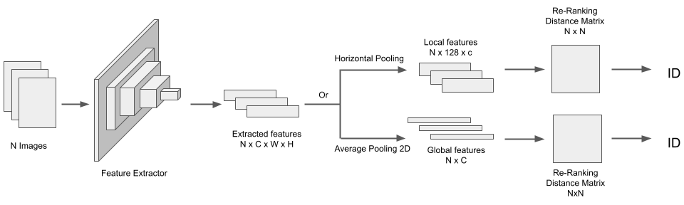

# Person Re-identification
Final project of Computer Vision

## Table of content

- [Person Re-identification](#person-re-identification)
  - [Table of content](#table-of-content)
  - [Students:](#students)
  - [Proposed method](#proposed-method)
  - [Dataset](#dataset)
  - [Dataset preparation](#dataset-preparation)
    - [Download raw dataset](#download-raw-dataset)
    - [Set dataset path](#set-dataset-path)
  - [Train](#train)
    - [Config](#config)
    - [Run](#run)
  - [Evaluation](#evaluation)

## Students:

| Name              | Student ID | Email                         |
|-------------------|------------|-------------------------------|
| Nguyen Hoang Quan | 18120145   | 18120145@student.hcmus.edu.vn |
| Le Minh Khoa      | 18120415   | 18120415@student.hcmus.edu.vn |

## Proposed method

## Dataset
- [Market-1501](http://zheng-lab.cecs.anu.edu.au/Project/project_reid.html)

## Dataset preparation
### Download raw dataset
Download Market-1501 via Google Drive: [link](https://drive.google.com/file/d/0B8-rUzbwVRk0c054eEozWG9COHM/view?resourcekey=0-8nyl7K9_x37HlQm34MmrYQ)

### Set dataset path
In `config.json` file, change `root` value to dataset path.

## Train
### Config
Check `config.json` file for training configuration.

### Run
Run `python main.py` to start training.

## Evaluation

| Methods                                  | Train feature | Test feature | Rank-1 | Rank-5 |  mAP  |
|------------------------------------------|:-------------:|:------------:|:------:|:------:|:-----:|
| Baseline                                 |     Global    |    Global    |  83.28 |  94.18 | 65.96 |
| Baseline                                 |     Local     |     Local    |  80.20 |  92.76 | 59.66 |
| Baseline                                 | Global, Local |    Global    |  84.14 |  93.97 | 67.58 |
| Baseline                                 | Global, Local |     Local    |  86.37 |  95.10 | 68.68 |
| Baseline + Identity Loss                 | Global, Local |    Global    |  83.55 |  93.35 | 67.66 |
| Baseline + Identity Loss                 | Global, Local |     Local    |  84.23 |  93.62 | 63.99 |
| Baseline + Identity Loss + Random Flip   | Global, Local |    Global    |  85.42 |  93.97 | 69.34 |
| Baseline + Identity Loss + Random Flip   | Global, Local |     Local    |  86.82 |  94.89 | 67.59 |
| Re-ranking                               | Global, Local |    Global    |  87.47 |  92.96 | 82.90 |
| Re-ranking + Identity Loss               | Global, Local |    Global    |  86.19 |  92.76 | 81.27 |
| Re-ranking + Identity loss + Random Flip | Global, Local |    Global    |  87.50 |  92.93 | 82.68 |